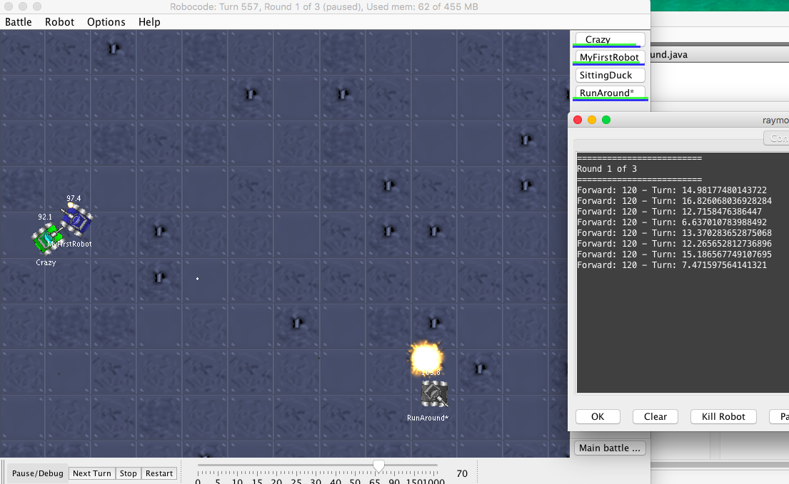

# What's This For?

Programming for FTC requires a working knowledge of Java. To help us practice we write programs within the [RoboCode](robocode.sourceforge.net).
 
## Recent Runs:

Rank | RobotName | TotalScore | BulletDmg | 1sts | 2nds
--- | --- | --- | --- | --- | ---
1st|sample.Walls|3122 (52%)|1133|3|10
2nd|sample.SpinBot|1965 (33%)|878|0|0
3rd|sample.Crazy|855 (14%)|315|0|0
4th|raymondBots.Gort*|65 (1%)|60|0|0

 Worse than previous Record: 4% Total Score : June 13th
 
 Worse than previous Record: 14% Total Score : June 2nd
  
## Getting Started
As we know, setup can be tricky...but guess what...there is a video to help you:
http://www.youtube.com/watch?v=GyVH8_C1QbQ 

We're all going to use the same version:
 GOTO: https://sourceforge.net/projects/robocode/files/robocode/1.9.2.5/
 Download: robocode-1.9.2.5-setup.jar

It's pretty well documented: 
http://robowiki.net/wiki/Robocode_Download_And_Install
But if you have questions, or need additional explanation, please don't hesitate to ask me, or your teammates.

I would suggest just copy, paste this example code for your first bot, to just see how the game works and how to run bots in the ring.
http://robowiki.net/wiki/Robocode/My_First_Robot

